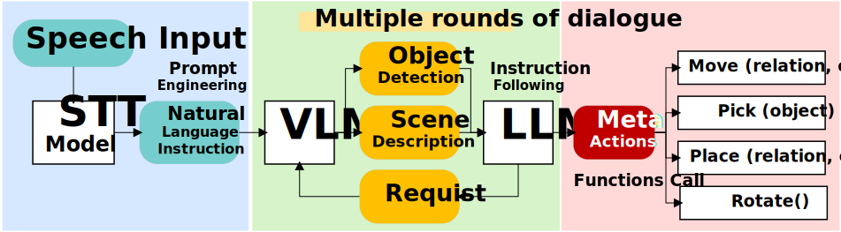

# LLM-driven Robotic Arm
 This is a project involving an intelligent robotic arm that uses a large language model to make decisions and generate actions for general-purpose operations.

## Introduction
The framework consists of an STT module, a decision module, and the robotic arm entity (Magician E6). After the STT module converts voice input into text, the decision module generates a sequence of meta actions, which are sent to the robotic arm (execution module) as function calls to perform the final actions. The decision module is composed of a VLM (Qwen-VL-Plus) and an LLM (Ernie-4.0), where the VLM is responsible for perceiving the environment and providing detailed scene descriptions to the LLM. The LLM then generates a sequence of meta actions based on the real-time scene description.

By leveraging the common-sense capabilities of LLMs, the robotic arm can extend beyond task-specific constraints to demonstrate exceptional general-purpose functionality. It can generalize to a variety of everyday tasks, such as grasping objects, arranging flowers in a vase, watering plants, and greeting people.

## Demo
https://github.com/user-attachments/assets/11538fc8-fa0d-4f95-85f1-10a14433232c
